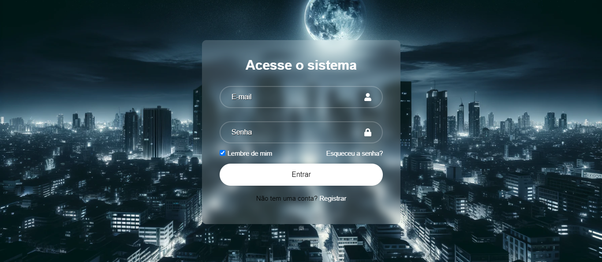

# React Login System

Esse é o meu primeiro projeto utilizando React, no qual desenvolvi uma interface simples de login. O projeto foi criado com Vite, React e React Icons, e inclui funcionalidades básicas de autenticação de usuários.



## Funcionalidades

- Formulário de Login: Permite ao usuário inserir seu e-mail e senha.
- Validação de Campos: Todos os campos são obrigatórios.
- Alertas de Envio: Um alerta é exibido ao enviar os dados do formulário.
- Lembrar de Mim: Opção para salvar as informações de login.
- Esqueci a Senha: Link para recuperação de senha.
- Link para Registro: Se o usuário não tiver uma conta, há uma opção para se registrar.

## Tecnologias Utilizadas

- React: Biblioteca JavaScript para construção de interfaces de usuário.
- Vite: Ferramenta de build rápida para desenvolvimento front-end.
- React Icons: Utilizado para exibir ícones de usuário e cadeado no formulário.
- CSS: Estilização customizada para o layout do formulário de login.

## Como Executar o Projeto

Para instalar as dependência do projeto (bibliotecas e dependências de desenvolvimento):

```bash
  npm install
```

Inicie o servidor de desenvolvimento:

```bash
  npm run dev
```

## Aprendizado

Este projeto me ajudou a entender melhor a estrutura de um projeto React. Foi uma boa experiência para iniciar com React, aprendendo a lidar com componentes funcionais, eventos de formulário e estilização CSS.

**_Entre em contato comigo_**

- **E-mail**: [izabelle.alvesbl@gmail.com](mailto:izabelle.alvesbl@gmail.com)
- **LinkedIn**: [Izabelle Alves](https://www.linkedin.com/in/izabellealvess/)
